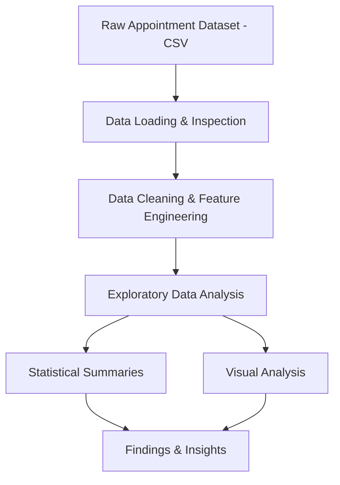

# Medical Appointment No-Show Analysis

An exploratory data analysis project investigating the factors that predict whether a patient will miss a scheduled medical appointment. The analysis uses a real-world dataset of 110,000+ appointments from Brazil to identify behavioral, demographic, and scheduling patterns associated with no-show rates.

This project demonstrates end-to-end data analysis skills: data cleaning, feature engineering, statistical exploration, and visual communication of findings.

---

## Why This Project

No-show appointments are a significant operational problem for healthcare systems — they waste clinical resources, reduce patient access, and increase costs. Understanding which patient segments and scheduling conditions are most associated with no-shows enables more targeted interventions like reminder systems, overbooking strategies, and outreach programs.

This project approaches the problem from a data analyst and data scientist perspective: starting with raw records and working toward actionable, evidence-backed insights.

---

## Problem

Healthcare providers schedule thousands of appointments per month, but a meaningful percentage of patients fail to show up with little or no notice. Without data-driven insight into who is likely to miss and why, intervention strategies are applied broadly and inefficiently.

**Core question:** What patient and scheduling characteristics are most predictive of a no-show?

---

## Dataset

**Source:** Kaggle — [Medical Appointment No Shows](https://www.kaggle.com/datasets/joniarroba/noshowappointments)  
**Records:** 110,527 appointments  
**Location:** Vitória, Espírito Santo, Brazil  
**Period:** April – June 2016

| Variable | Description |
|---|---|
| `PatientId` | Unique patient identifier |
| `AppointmentID` | Unique appointment identifier |
| `Gender` | Patient gender (M/F) |
| `ScheduledDay` | Date and time the appointment was booked |
| `AppointmentDay` | Date the appointment was scheduled for |
| `Age` | Patient age |
| `Neighbourhood` | Location of the clinic |
| `Scholarship` | Whether the patient is enrolled in Bolsa Família welfare program |
| `Hipertension` | Whether the patient has hypertension |
| `Diabetes` | Whether the patient has diabetes |
| `Alcoholism` | Whether the patient has an alcoholism diagnosis |
| `Handcap` | Disability level (0–4) |
| `SMS_received` | Whether the patient received an SMS reminder |
| `No-show` | Target variable — whether the patient missed the appointment |

---

## System Architecture




### Analysis Pipeline

| Stage | Description |
|---|---|
| **Ingestion** | Load raw CSV and inspect shape, types, and missing values |
| **Cleaning** | Fix column names, parse datetime fields, remove invalid records |
| **Feature Engineering** | Calculate lead time (days between scheduling and appointment) |
| **EDA** | Analyze no-show rates by demographic, condition, and scheduling variables |
| **Visualization** | Bar charts, distributions, and comparison plots across key segments |
| **Insights** | Summarize findings and identify actionable patterns |

---

## Technologies Used

- Python
- Pandas
- Matplotlib
- Jupyter Notebook
- CSV Data Processing

---

## Project Structure

```
Medical-Appointment-No-Show-Analysis/
├── Investigate_a_Dataset.ipynb     # Full analysis notebook
├── main.py                         # Script version of the analysis
├── noshowappointments-kagglev2-may-2016.csv  # Raw dataset
├── images/
│   └── noshow_pipeline_architecture.png
└── README.md
```

---

## Key Findings

- **No-show rate overall:** ~20% of scheduled appointments were missed
- **Lead time matters:** Appointments scheduled further in advance had significantly higher no-show rates — same-day and next-day appointments showed much better attendance
- **SMS reminders had a counterintuitive pattern:** Patients who received SMS reminders actually showed slightly higher no-show rates, likely because reminders were sent to patients already identified as higher risk
- **Age effect:** Younger patients (teens and young adults) had the highest no-show rates; patients over 60 were the most reliable attendees
- **Scholarship enrollment:** Patients enrolled in the Bolsa Família welfare program had higher no-show rates than non-enrolled patients
- **Chronic conditions:** Patients with hypertension or diabetes showed lower no-show rates, likely due to higher medical engagement

---

## Example Queries

**No-show rate by gender:**
```python
df.groupby('Gender')['No-show'].value_counts(normalize=True).unstack()
```

**Average lead time by attendance:**
```python
df.groupby('No-show')['lead_time_days'].mean()
```

**No-show rate by age group:**
```python
df.groupby('age_group')['No-show'].apply(lambda x: (x == 'Yes').mean())
```

---

## Future Improvements

- Build a classification model (Logistic Regression, Random Forest) to predict no-show probability per patient
- Introduce neighborhood-level analysis to identify geographic patterns in attendance
- Analyze repeat patients to distinguish between habitual no-shows vs. one-time misses
- Create an interactive dashboard (Plotly/Streamlit) for operational use by clinic staff
- Simulate the ROI of targeted SMS campaigns using model predictions
